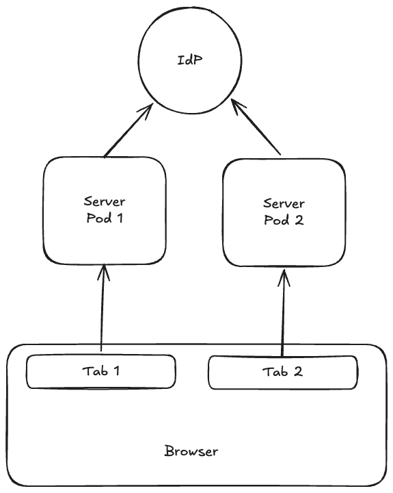

# Exercise 3: Token Refresh Race Conditions

## Scenario

The application runs against a multi-pod backend. A user has the same app open
in two browser tabs:

1. `Tab 1` and `Tab 2` share the same access token.
2. The token expires at the same time in both tabs.
3. Both tabs may try to refresh it simultaneously.

This can cause a race condition where one tab refreshes successfully while the
other invalidates the session or logs the user out.

## Task

Explain how you would design the token refresh flow to prevent this race
condition.

Cover:

1. Cross-tab coordination.
2. Handling requests during refresh.
3. Backend guarantees for refresh token rotation or reuse.
4. Recovery from failed or stale refresh attempts.

Use the diagram as a reference.

### Follow-up

Where and how would you store access and refresh tokens securely in the browser ?
